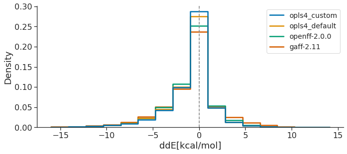

The Open Force Field (OpenFF) Initiative focuses to build, optimize and assess a general force field (FF) using an automated and reproducible procedure, with all software, data, and workflows made freely available.
Recently, the second generation of small molecule force field “Sage” (OpenFF 2.y.z) [was released](https://openforcefield.org/community/news/general/sage2.0.0-release/), featuring a retrained Lennard-Jones parameters in addition to continued improvements to the valence parameters.
In this report, academic and industrial partners of the OpenFF Initiative worked together to assess the performance of recent OpenFF releases and other small molecule FFs against reference quantum mechanical (QM) calculations at the B3LYP-D3BJ/DZVP level of theory. The work represents a teaser of the forthcoming OpenFF benchmark manuscript and an extension of [the article from Lim et al](https://f1000research.com/articles/9-1390/v1).
Each industry partner selected compounds from their internal research or compound collections; a total set of 18,154 were studied. As part of this study, a large portion of the compounds (10,141) were compiled and made publicly available on the QCArchive, while the rest of the compounds remained proprietary and were studied internally at each industry partner, with only overall performance statistics being released. The study was enabled by the development of a standard workflow that could be easily installed and run at the sites of each collaborator. The identical approach used by each partner allowed the sharing of analysis data without compromising the confidentiality of the proprietary sets of molecules.
Force fields belonging to three families were assessed: 
*	GAFF-2.11
*	OPLS4 with both custom (OPLS4CST) and default parameters (OPLS4DEF)
*	OpenFF
	*	Smirnoff99Frosst
	*	Parsely, 4 versions (OpenFF-1.0.0, OpenFF-1.1.1, OpenFF-1.2.1, OpenFF-1.3.0)
	*	Sage (OpenFF-2.0.0)

For a dataset containing a total of 137,052 molecular conformations, we compared the structures and energetics of conformers optimized using force fields to those optimized using quantum mechanical methods. 

#### ENERGETIC COMPARISON – PUBLIC DATASET 
The energetic agreement was assessed by calculating the energy differences (dEFF) between each FF optimized conformer <i>i</i> and the FF conformer with minimum energy (EFF,min), relative to the energy difference (dEQM) between each corresponding QM optimized conformer <i>i</i> and the QM conformer with minimum energy (EQM,min). 

ddEi = dEFF,i − dEQM,I = (EFF,i - EFF,min) – (EQM,i – EQM,min)

The following plot shows the ddE distributions of all the conformers of the OpenFF Public Industry Dataset, as obtained for the latest version of each FF family (other FF curves left out for clarity). Ideally, an optimal FF would exhibit higher ddE peak around zero, meaning that the FF reproduces correctly the QM relative energies between conformers.

#### GEOMETRIC COMPARISON – PUBLIC DATASET	
We next examine agreement between FF-optimized geometries and those from QM, as calculated by each molecule's root-mean-square deviation of atomic positions (RMSD) and Torsion Fingerprint Deviation (TFD) scores with reference to the parent QM-optimized geometry. RMSD is the more common metric, yet may depend on the molecule size, biasing interpretation of geometric agreement. 

In contrast, TFD was designed to be more independent of molecule size, in order to compare molecular conformations more meaningfully, helping to offset issues with RMSD where larger, more flexible molecules can contribute the most to RMSD. The TFD score between two molecular structures is evaluated by computing, normalizing, and Gaussian weighting the (pseudo-)torsion deviation for each bond and ring system.

Both RMSD and TFD are similar, in that a FF which yields optimized geometries closer to those of QM would have smaller RMSD and TFD values.
Taken together, all this data suggests that, over the OpenFF Public Industry Dataset, OpenFF-2.0.0 is superior to GAFF-2.11 and almost approaches the performance of OPLS4DEF particularly in the TFD metric, lagging only behind OPLS4CST, which is valuable since the comparison between force fields featuring default parameters is more appropriate.

#### ENERGETIC COMPARISON – PROPRIETARY DATASET	
The following plots illustrate, over the OpenFF Industry-Proprietary Dataset, how OpenFF has progressively improved across versions (Smirnoff99Frosst, OpenFF-1.0.0, OpenFF-1.3.0, OpenFF-2.0.0; other FF curves left out for clarity) in both the energetic and geometric metrics.

#### GEOMETRIC COMPARISON – PROPRIETARY DATASET

These results clearly show that OpenFF, at each new version, has improved both energetics and geometries in reproducing the QM reference, with OpenFF-2.0.0 “Sage” providing remarkable increases in accuracy. Overall, our study highlights the progress the OpenFF Initiative has made towards its goal of producing high quality public, open force fields built with infrastructure which enables rapid parameterization and benchmarking, available to everyone. Future OpenFF updates are planned to include improved treatment of torsions (via Wiberg bond order-based parameter interpolation), better handling of trivalent nitrogen geometries, a biopolymer force field and an OpenFF software stack that will enable the conversion from OpenMM objects to file formats understood by other molecular simulation engines, like AMBER and GROMACS ([OpenFF Interchange](https://openforcefield.org/community/news/science-updates/interchange-update-2021-11-10/)). Additionally, a [tool for fitting bespoke torsion parameters](https://openforcefield.org/community/news/science-updates/bespokefit-update-2021-10-20/) for specific molecules/chemistries of interest will soon be available, likely further improving accuracy.

#### CONTRIBUTIONS
The following people and pharma partners have contributed to this benchmark assessment:
* Lorenzo D'Amore (OpenFF Initiative, Janssen R&D)
* David F. Hahn (Janssen R&D)
* David L. Dotson (OpenFF Initiative)
* Joshua T. Horton (Newcastle University)
* Ian Craig (BASF)
* Thomas Fox (Boehringer Ingelheim)
* Alberto Gobbi (Genentech)
* Sirish Kaushik Lakkaraju (Bristol Myers Squibb)
* Xavier Lucas (Roche)
* Katharina Meier (Bayer)
* David L. Mobley (OpenFF Initiative, UC Irvine)
* Arjun Narayanan (Vertex)
* Christina E.M. Schindler (Merck)
* William Swope (Genentech)
* Gary Tresadern (Janssen R&D)
* Pieter J. in 't Veld (BASF)
* Jeffrey Wagner (OpenFF Initiative, UC Irvine)
* Bai Xue (XtalPi)

