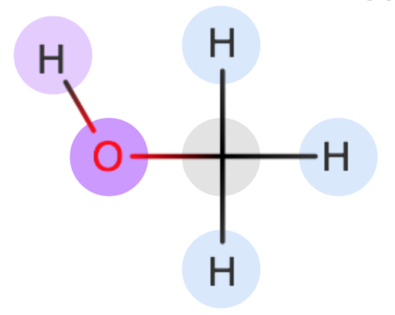

##### Force fields released by the Open Force Field Initiative can be accessed in the GitHub [repository](https://github.com/openforcefield/openforcefields).

The files available for [download](https://github.com/openforcefield/openforcefields/releases) are in SMIRKS Native Open Force Field (SMIRNOFF) format. Details about this new format are documented in our recent [publication](https://www.doi.org/10.1021/acs.jctc.8b00640) (or [preprint](https://doi.org/10.1101/286542)), and the most recent specification can be found in the [Open Force Field Toolkit documentation](https://open-forcefield-toolkit.readthedocs.io/en/latest/smirnoff.html). You can parameterize small molecules with SMIRNOFF using the ForceField class in the [Open Force Field toolkit](https://github.com/openforcefield/openforcefield) for simulations with [OpenMM](http://openmm.org/). The resulting system can also be converted to several other simulation formats using [ParmEd](http://parmed.github.io/ParmEd/html/index.html). Usage examples can be found in our [GitHub repository](https://github.com/openforcefield/openforcefield/tree/master/examples).


## Parsley ##

### Versioning: openff-1.y.z ###

_Parsley_ (OpenFF-1.y.z) is the codename for the first generation of optimized small molecule force fields from the Open Force Field Initiative. Parsley force fields represent a refit of the AMBER-lineage _smirnoff99Frosst_ to large sets of quantum chemical data, and assign parameters using direct chemical perception, using the [SMIRNOFF](https://open-forcefield-toolkit.readthedocs.io/en/latest/smirnoff.html) specification. Read more about the most important aspects of fitting and benchmarking procedures for Parsley in the [blog post](/community/news/general/introducing-openforcefield-1.0/). See more information about naming and semantic versioning [here](/force-fields/versioning/).

All currently available versions are listed below. Each force field is currently available in two forms - with and without bond constraints to hydrogen. The default version of each force field is suitable for typical molecular dynamics simulations with constrained bonds to hydrogen. The unconstrained version of each force field should be used when single-point energies are a major concern (e.g. geometry optimizations) and when comparing the force field to QM data.

### openff-1.3.1 ###

#### Release date: June 21, 2021

The new force field files in this release are identical to the openff-1.3.0 release, except that two angle parameters have been reverted to their original values from smirnoff99Frosst 1.1.0. 

Full details are available in the [GitHub release notes](https://github.com/openforcefield/openff-forcefields/releases/tag/1.3.1-alpha.1) for 





### openff-1.3.0 ###

#### Release date: October 22, 2020

This minor release contains a fix of amide-related issues; (1) a poor performance of v1.2 in reproducing amide torsional energy profiles and (2) absence of appropriate torsion parameters for dialkyl amides.
Full details are available in the [GitHub release notes](https://github.com/openforcefield/openforcefield-forcebalance/releases/tag/v1.3.0).




### openff-1.2.1 ###

#### Release date: September 9, 2020

This bugfix release manually changes two bond force constants (`b24` and `b27`) to resolve an issue seen in propyne substituents when using hydrogen mass repartitioning with a 4fs timestep. Full details are available at https://github.com/openforcefield/openforcefields/issues/19 and in the `reproduce_propyne_hmr.ipynb` notebook in the release assets on GitHub.




### openff-1.2.0 ###

#### Release date: June 1, 2020

This Parsley update contains the following improvements:

- Dramatically improved QM fitting dataset increased parameter quality across the board, for almost all molecules tested;
- Improved treatment of phosphonate groups;
- Substantial improvements to torsions for molecules with single bonds between a divalent nitrogen and a trivalent nitrogen.

Read more details about this force field update in the [release notes](https://github.com/openforcefield/openforcefield-forcebalance/releases/tag/v1.2.0).

#### Datasets

Datasets used for training and initial benchmarking of OpenFF-1.2.0 force field are listed below:

| Dataset | SMILES  &ensp; |  PDF |   Structures |
|---------|--------|-----|------------|
| [Fitting](https://github.com/openforcefield/openforcefield-forcebalance/releases/tag/v1.2.0) | [SMI](https://github.com/openforcefield/openforcefield-forcebalance/releases/download/v1.2.0/training_unique_molecules.smi) | [PDF](https://github.com/openforcefield/openforcefield-forcebalance/releases/download/v1.2.0/training_unique_molecules.pdf) |  &ensp; [Release tarball](https://github.com/openforcefield/openforcefield-forcebalance/releases/download/v1.2.0/release_1.2.0.tar.gz) |
| [Initial benchmark](https://github.com/openforcefield/openforcefield-forcebalance/releases/tag/v1.2.0) | [SMI](https://github.com/openforcefield/release-1-benchmarking/releases/download/v1.0.0/full_set_unique_molecules.smi) | [PDF](https://github.com/openforcefield/release-1-benchmarking/releases/download/v1.0.0/full_set_unique_molecules.pdf) |  &ensp; [Release tarball](https://github.com/openforcefield/release-1-benchmarking/releases/download/v1.0.0/release-1-QM-benchmark.tar.gz) |
| [Lim and Mobley benchmark (in preparation, updates possible)](https://chemrxiv.org/articles/Benchmark_Assessment_of_Molecular_Geometries_and_Energies_from_Small_Molecule_Force_Fields/12551867/1) &ensp; | [SMI](https://github.com/MobleyLab/benchmarkff/blob/91476147f35579bc52bf984839fd20c72a61d76d/molecules/set_v03_non_redundant/trim3_full_qcarchive.smi)  | [PDF](https://github.com/MobleyLab/benchmarkff/raw/91476147f35579bc52bf984839fd20c72a61d76d/molecules/set_v03_non_redundant/trim3_full_qcarchive.pdf)   | &ensp; [SDF](https://github.com/MobleyLab/benchmarkff/raw/91476147f35579bc52bf984839fd20c72a61d76d/molecules/set_v03_non_redundant/trim3_full_qcarchive.sdf) |

The SMILES and PDF-format records are entirely derived from the structure files and may be updated without notice. If discrepancies are found, the structure files should be considered the authoritative reference.  




### openff-1.0.1 ###

#### Release date: April 14, 2020

This bugfix release contains the following changes: (1) Addition of monatomic ion LibraryCharges.




### openff-1.1.0 ###

#### Release date: March 3, 2020

The first _Parsley_ update contains results of valence parameter re-fitting, with small modifications in the input force field. The main highlights include:

- Addition of two new bond terms and one angle term;
- Modification of periodicity for N-N rotation;
- Addition of some proper and improper torsions.

Read more details about the modified parameters in the [release notes](https://github.com/openforcefield/openforcefield-forcebalance/releases/tag/v1.1.0) or in the [blog post](/community/news/science-updates/v1.1.0-parsley-update-2020-03-03/).




### openff-1.0.0 ###

#### Release date: October 12, 2019

The first official small molecule force field release from the Open Force Field Initiative. Fitting and benchmarking details are described [here](/community/news/general/introducing-openforcefield-1.0/).





## smirnoff99Frosst ##

A minimalist AMBER-compatible general small molecule force field with excellent coverage of druglike chemical space, using the [SMIRNOFF](https://open-forcefield-toolkit.readthedocs.io/en/0.3.0/smirnoff.html) direct chemical perception specification.

This force field achieves comparable accuracy to GAFF in physical properties, but with a decrease in complexity from over 6000 lines of parameters to only ~300 lines using the SMARTS-based direct chemical perception possible with [SMIRNOFF](https://open-forcefield-toolkit.readthedocs.io/en/topology/smirnoff.html). Read more about the latter and creation of _smirnoff99Frosst_ in the [publication](https://pubs.acs.org/doi/10.1021/acs.jctc.8b00640) or in the [preprint](https://doi.org/10.1101/286542).

_smirnoff99Frosst_ was used as a starting point to generate the first optimized Open Force Field (Parsley) while building automated infrastructure for rapid parameterization of accurate small molecule force fields.




